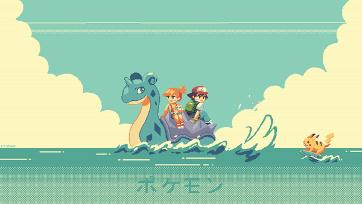

  

  ### Namaste, I'm RahulD999! 🖥️👨‍💻
  
  
I'm a dev enthusiast, building intelligent and scalable solutions that bridge AI and full-stack development.

<!--  -->
<!--  -->

Here are some ideas to get you started:

- 🔭 I’m currently working on ...
- 🌱 I’m currently learning ...
- 👯 I’m looking to collaborate on ...
- 🤔 I’m looking for help with ...
- 💬 Ask me about ...
- 📫 How to reach me: ...
- 😄 Pronouns: ...
- ⚡ Fun fact: ...

